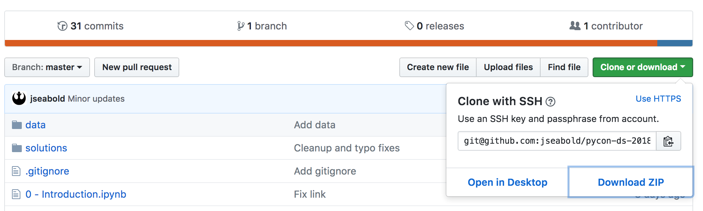
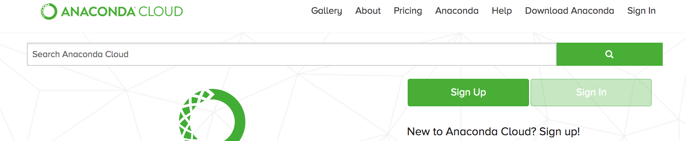
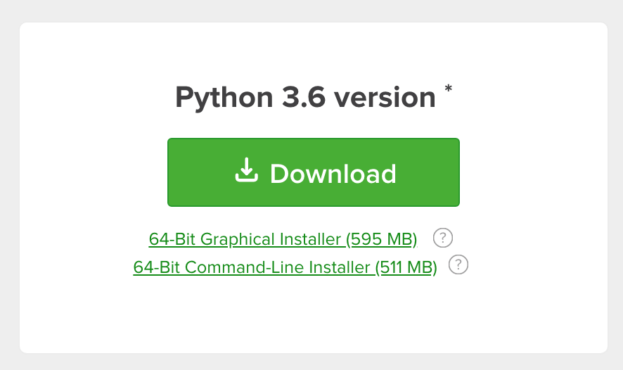

# Introducción a Python

Este tutorial es una versión traducida y reducida del tutorial [Introduction to Python for Data Science](https://github.com/jseabold/pycon-ds-2018) impartido en Pycon 2018.

## Requisitos

### Descarga el tutorial

Si deseas hacer el tutorial junto con nosotros, siga estos pasos

*si estas familiarizado con git*, clona este repositorio. Para hacerlo, en tu linea de comandos, ejecuta

```bash
git clone git@github.com:darwing1210/sqlalchemy-introduccion
```

*si no estas familiarizado con git*, puedes descargar el código directamente desde GitHub.



Si clonaste antes el repositorio y deseas tener la ultima versión, ejecuta

```
git pull
```

O, descarga el archivo .zip nuevamente

### Instala los paquetes

*Si no tienes conda o anaconda instalados*, descarga la distribución de Python de Anaconda. Ve a [anaconda.org](https://anaconda.org) y haz click en el boton Descargar (Download).
 


Selecciona la versión 3.X para tu SO (debería de seleccionarse automaticamente). Descarga e instala Anaconda.



Una vez instalado conda o anaconda, escribe lo siguiente desde *este mismo directorio* en tu terminal o linea de comandos.

```bash
conda env create -f environment.yaml
```

### Activa el Entorno con los Paquetes

Ahora necesita cambiar al entorno que acabamos de crear con los paquetes instalados. Si usas macOS o linux, ejecuta en la terminal

```bash
source activate sqlalchemy-introduccion
```

Si usas Windows, ejecute en la linea de comandos

```bash
activate sqlalchemy-introduccion
```

Asegúrate de que puedes ejecutar los Jupyter Notebooks

```bash
jupyter notebook
```

.
